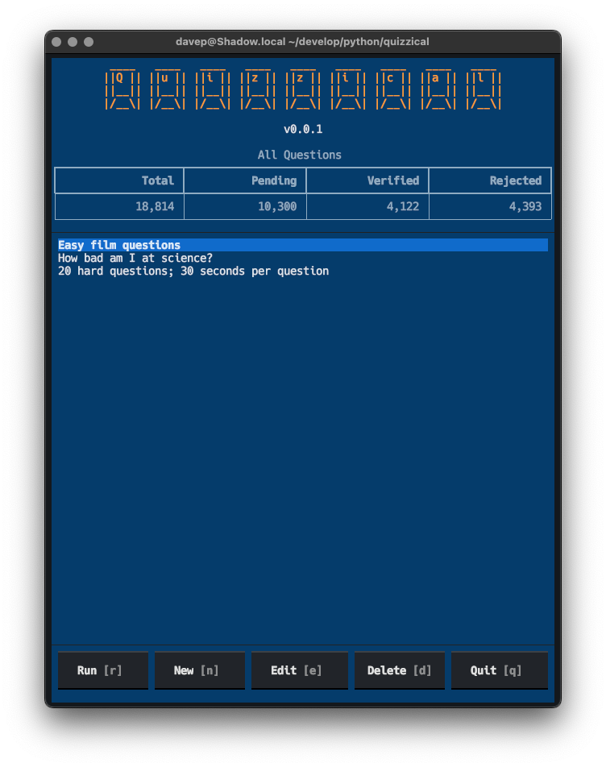
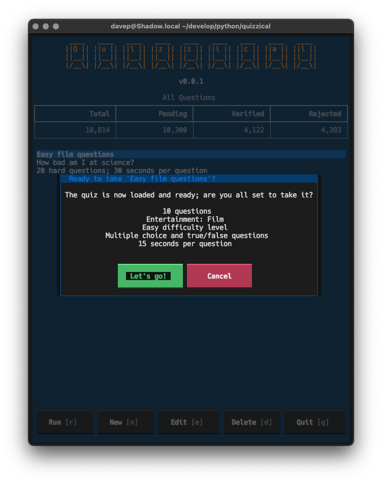
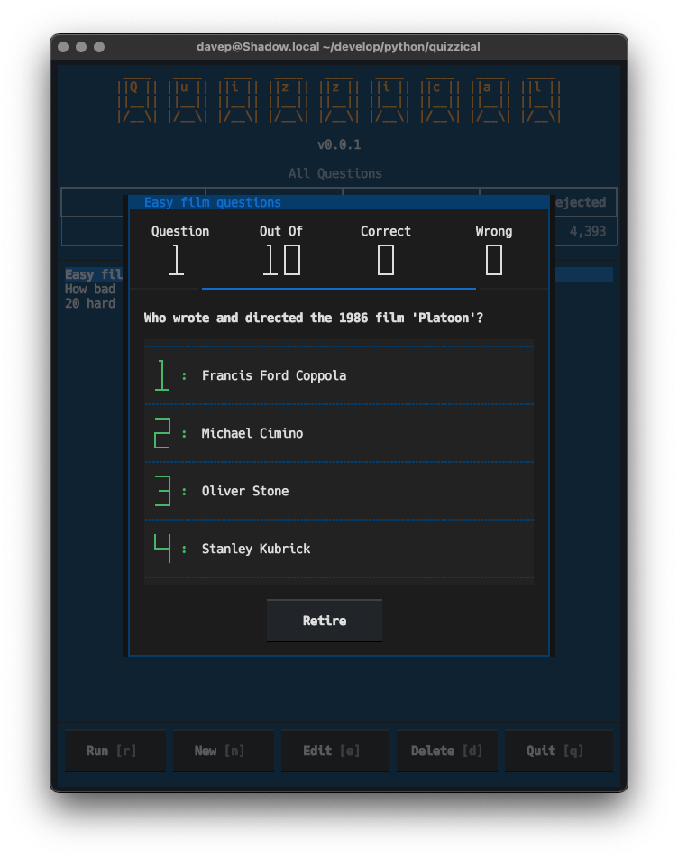
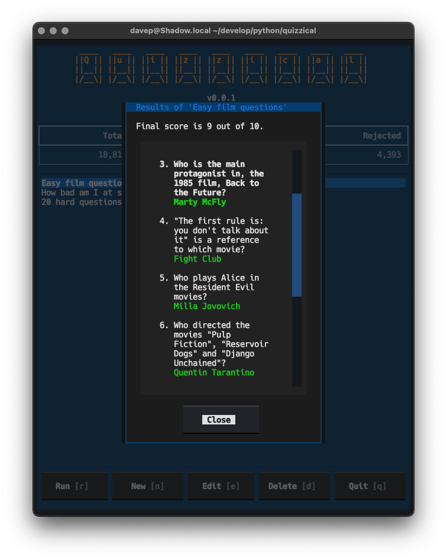

# Quizzical

## Introduction

Quizzical is a terminal-based quiz game, using [The Open Trivia
Database](https://opentdb.com/) as the back end.



## Installing

The package can be installed using [`pipx`](https://pypa.github.io/pipx/):

```sh
$ pipx install quizzical
```

Once installed run the `quizzical` command.

## Playing the game

Hopefully the interface is pretty straightforward: run up the application,
use the `New` button to create a new quiz with your choice of parameters,
use the `Run` button to play a game. When you run a new game you'll be shown
the parameters:



and once you start you'll be shown a series of questions; press keys
<kbd>1</kbd>, <kbd>2</kbd>, <kbd>3</kbd> or <kbd>4</kbd> to answer each one.



Once the quiz is over you can view your results and see which answers were
right and which were wrong:



## Getting help

If you need help, or have any ideas, please feel free to [raise an
issue](https://github.com/davep/quizzical/issues) or [start a
discussion](https://github.com/davep/quizzical/discussions).

## TODO

Things I'm considering adding or addressing:

- [ ] Add session token support (less frequent question repeats).
- [ ] More quiz information in the main quiz list.
- [ ] Record scores for each game played, provide a history view.
- [ ] Allow answering a question with the mouse.

[//]: # (README.md ends here)
